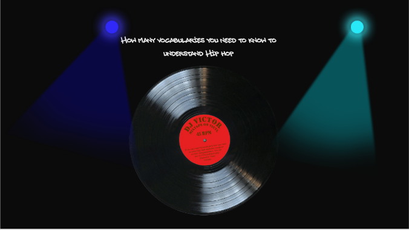
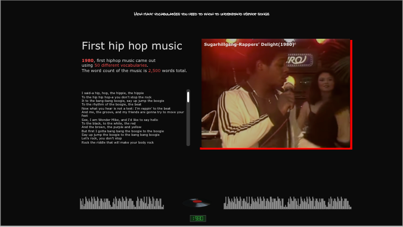
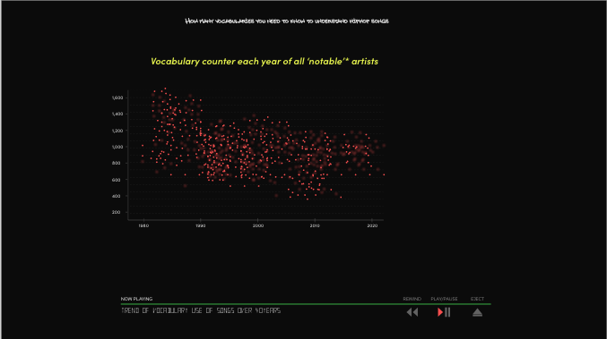
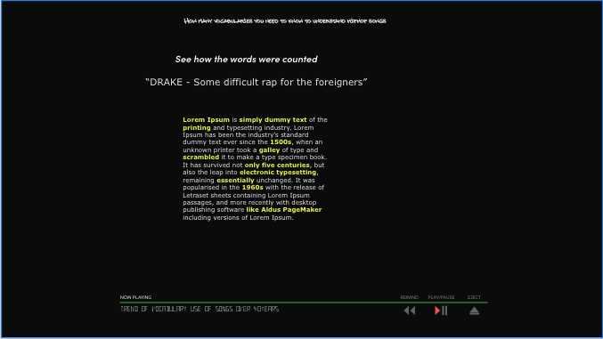
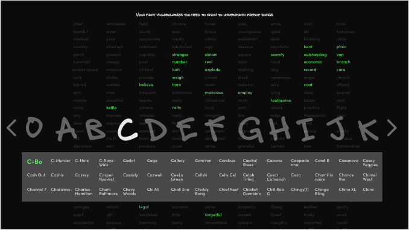
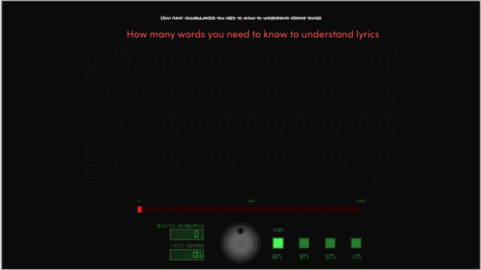
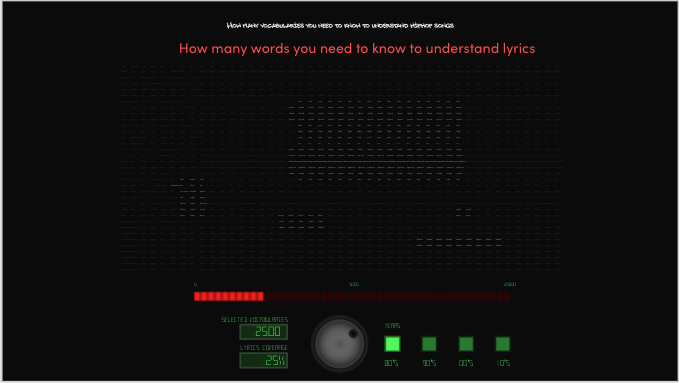

<h1 style='text-decoration:underline;font-weight:300'>Hip hop Vocabulary Project<h1>

Project Goal

<ul style='margin-top:25px;
    font-size:18px;
    font-weight:400;
    list-style: square inside '>

<li style='font-size:12px'>
Exploring how differently vocabulary has been used from the first generation of hip hop (80's) till the hip hop songs today
</li>

 

<li style='font-size:12px'>
<strong style='color:red'>Across songs,</strong> how vocabulary was used? Has they become more similar to one another or become diverse and distinctive to each other
</li>
 

<li style='font-size:12px'>
<strong style='color:red'>Within song</strong> how vocabulary was used? Has lyrics become more repetitive and used less diverse songs? If so, how less diverse has they become?
</li>
 

<li style='font-size:12px'>
<strong style='color:red'>If lyrics became less diverse,</strong>
What would be the word distribution across throughout the songs each era? By knowing most frequent 10% or 20% of vocabulary, how much of entire word pool of each era could be covered? 
</li>
</ul>

Landing Page

Creating a mood like hip hop club before getting into the main part.The overall theme of this project is going to be a music-player-like theme to explore the lyrics trend of hip hop songs over time.

First Hip Hop Music

 

Shows the first hip hop song ever as an entry with the full covering music video background to hype up the mood of the project and show the lyrics of the song within a small partiall lyrics section.

Overall Statistics

Statistics showing the word distribution within songs.
This distribution shows how repetitive songs used to be and how they have changed and how they are like now.

Methodology

Shows a short animation to show the methodology of this project because the methodology of 'unique word set' could be misleading. So to make it clear, shows a short animation for the idea

Word explorer

Choose the artis from the options by artists' intial letter to deep dive into the 
lyrics usage of each artist

word coverage-1

 

Analogue music player interface leads the audice to the new exploring phase where user could controll the nob to increase or decrease the word range to explore and the word covered by the control nob range will be lit up to show the word coverage by the setting.

word coverage-2

The amount of the words lit up shows roughly how much portion was covered so far by controlling the nob

