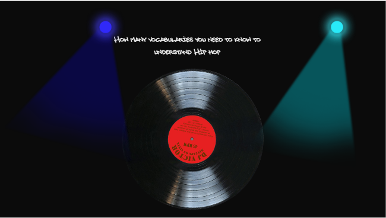
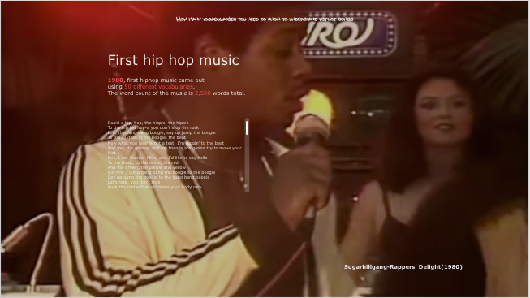
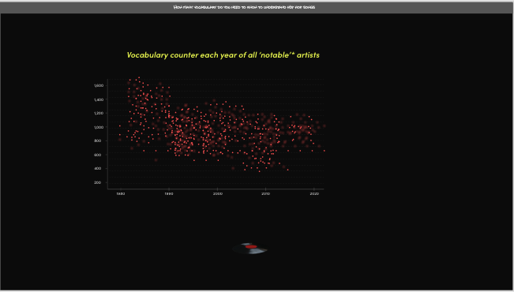
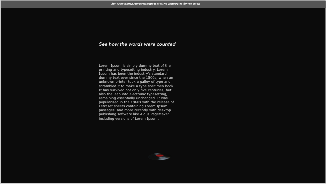
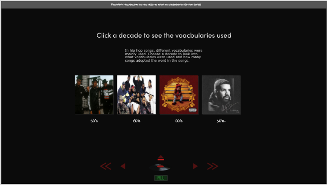
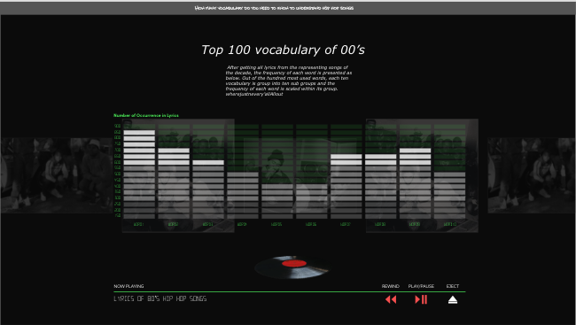
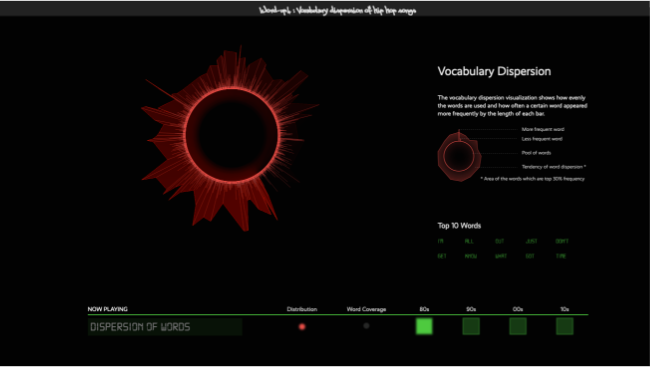
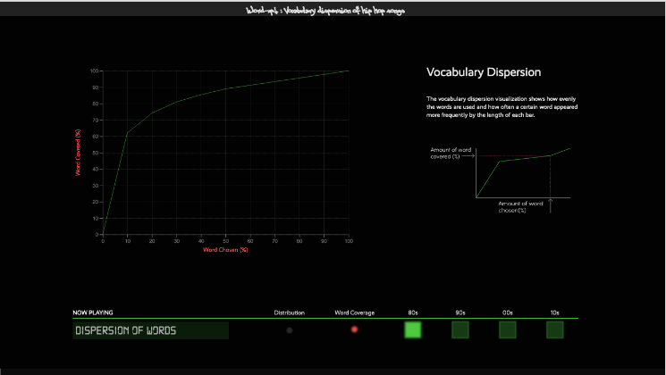

<h1 style='text-decoration:underline;font-weight:300'>Hip hop Vocabulary Project<h1>

Project Goal

<ul class='midsize'>

<li>
Exploring how differently vocabulary has been used from the first generation of hip hop (80's) till the hip hop songs today
</li>

 

<li>
<strong style='color:red'>Across songs,</strong> how vocabulary was used? Has they become more similar to one another or become diverse and distinctive to each other
</li>
 

<li>
<strong style='color:red'>Within song</strong> how vocabulary was used? Has lyrics become more repetitive and used less diverse songs? If so, how less diverse has they become?
</li>
 

<li>
<strong style='color:red'>If lyrics became less diverse,</strong>
What would be the word distribution across throughout the songs each era? By knowing most frequent 10% or 20% of vocabulary, how much of entire word pool of each era could be covered? 
</li>
</ul>

Landing Page

Creating a mood like hip hop club before getting into the main part.The overall theme of this project is going to be a music-player-like theme to explore the lyrics trend of hip hop songs over time.

First Hip Hop Music

 

Shows the first hip hop song ever as an entry with the full covering music video background to hype up the mood of the project and show the lyrics of the song within a small partiall lyrics section.

Overall Statistics

Statistics showing the word distribution within songs.
This distribution shows how repetitive songs used to be and how they have changed and how they are like now.

Methodology

Shows a short animation to show the methodology of this project because the methodology of 'unique word set' could be misleading. So to make it clear, shows a short animation for the idea

Exploring by decades

To explore the lyrics changes over time, make albums to represent each decade with the notable artists during the time.
And the animation is going to be LP-Player like interface.

Top 100 words during the era

Following the overall theme which is music player, the frequency of each word is visualized via the height of the equalizer bars of the analogue style music player.
The buttons below actually controlls the flow of the visualization.

Last Visual Summary-1

Shows the overall distribution each era across all the songs.
The First visualization shows how widely and diversely words are distributed and how certain words are more frequently adopted compared to the other words. 
Thie animation can be switched to the other visualization which shows the word coverage by decade.

Last Visual Summary-2

This page is dedicated to the summary of the word coverage.
By clicking different decades, audience can see how widely or less widely various vocabulary were adopted in each era.

