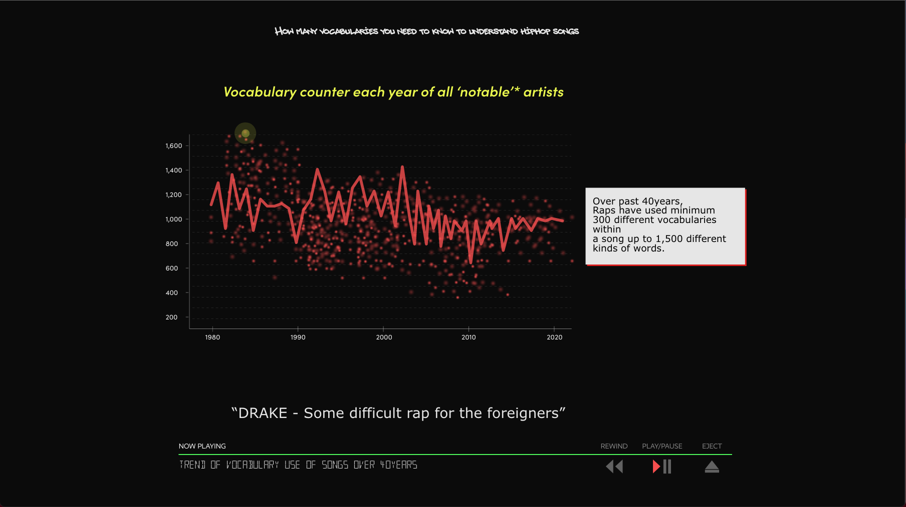

This is a brief prototyping taking screen shots from my adobe XD prototype tool.

Basically all the images and pages are based on scroll telling and
Thinking of sound as a background.

Alignment of images and text are not perfectly cleaned up this model 
and the basic scheme would be following this prototyping.

The main three things thinking of this project to be delivered are

** Vocabulary coverage 

** Vocabulary usage trend overtime

** The dispersion pattern of the vocabulary of the lyrics each decade

</img>
</img>
</img>
</img>
</img>
</img>
</img>
