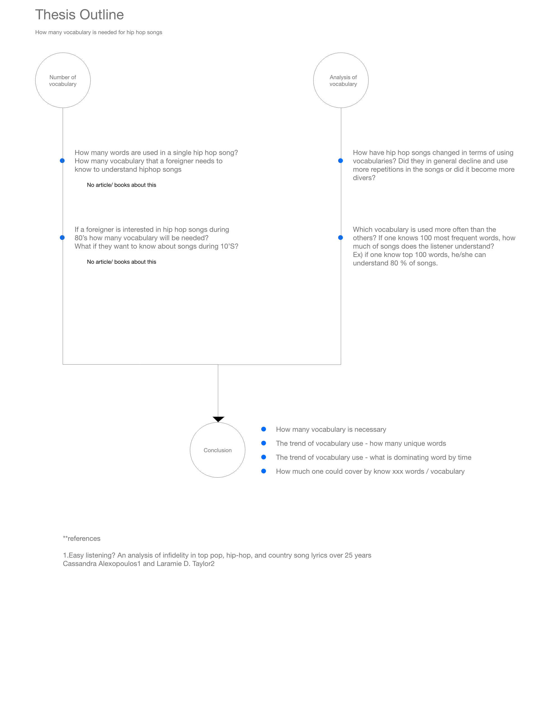

<h1> Word up</h1>
<h2> Quantitative analysis on hip hop lyrics </h2>
  

**Abstract** 
How many words does a foreign language speaker need to know to understand hip hop songs which use the comparably larger amount of words? This project began with this curiosity. This curiosity was challenged by the fact that knowing the meaning of words does not guarantee a listener could understand the context. This led me to a new research direction which is quantitative analysis on vocabulary of hip hop.
This study looks into two aspects of vocabulary used for rap. The first one is an analysis in each song. It infers that social factors came into play changing the vocabulary pattern in songs, for example ‘transition to a society which is more open to subjective perspective toward problems or issues’. This project verifies the assumption by seeing the quantitative analysis on rap.The second part of the research is about diversity of words across songs. This broader landscape proves the trend that hip hop culture has been leaning from its beginning (1980’s) to today. It tries to answer the question related to how vocabulary of songs has become similar to one another. 

