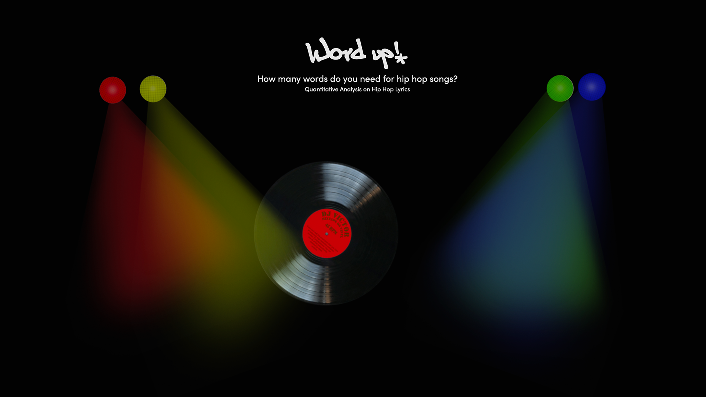
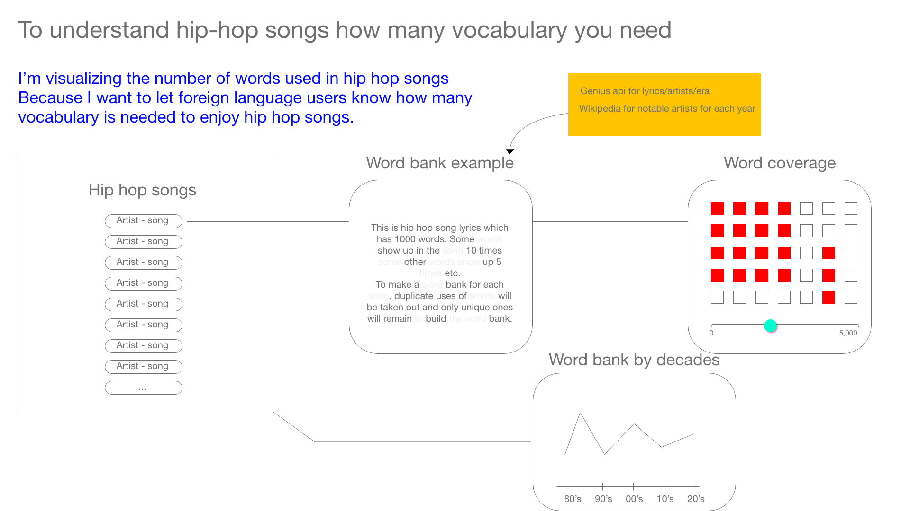

<h1> Word up</h1>
<h2>How many words do you need for hip hop songs?
   Quantitative Analysis on Hip Hop Lyrics</h2>
  

**Abstract** 
This project specifically focuses on two linguistic characteristics in songs. The first is how unique words are used in each song. This shows how diversely words are adapted to convey meaning. More unique words used in a song create more diversity and more complexity. The approach to measure the level of diversity in vocabulary is achieved by counting the unique instances of words: for example, if a certain word appears more than twice in a song, only the first instance is counted,  leaving the duplicates out of the word pool. 

The second is how broad the listeners’ vocabulary would have to be. This focuses on how various subjects such as gender fluidity and homosexuality, are dealt with in songs as well as how different topics are interpreted in each song.  Today, these new topics require new vocabulary because in the past, they did not exist in the general public sphere. In addition to the quantitative analysis of absolute word count that will be presented in this paper, proportion analysis will  also be included : how much percentile is covered by having certain coverage or word. For example, by covering the top 10% of used vocabulary, we can estimate how much percentage of vocabulary is covered in a certain decade. 

To analyze trends over time, this project covers hip hop songs from the first advent of it (1980) to the songs of today(up to 2020). The user is able to compare the changes by navigating dispersion patterns visually by decade and also to see what is the general pattern of vocabulary by seeing the generative art form of word dispersion. 

Since this project shows an aspect of pop culture linguistically, the vinyl player interface is adopted as a visual inspiration. The user can explore the processed information as if one plays with an analog music player.

